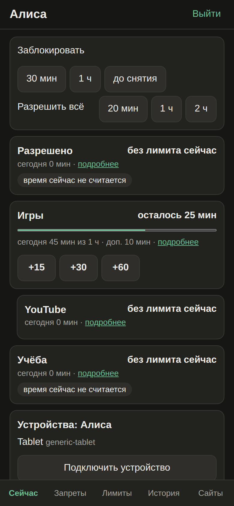
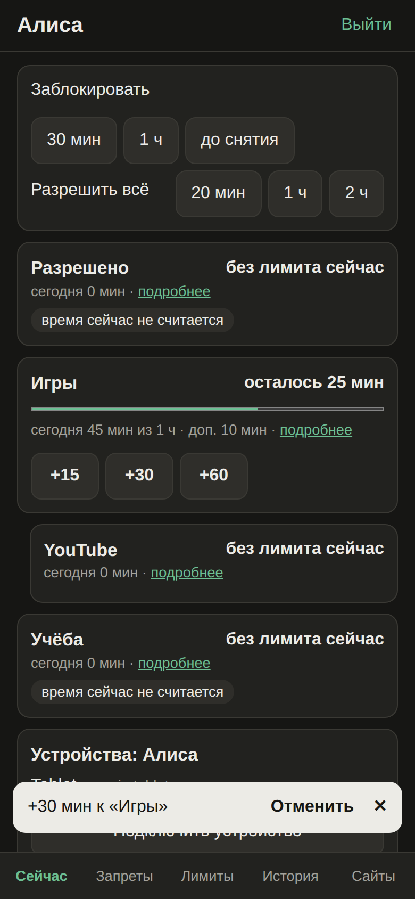
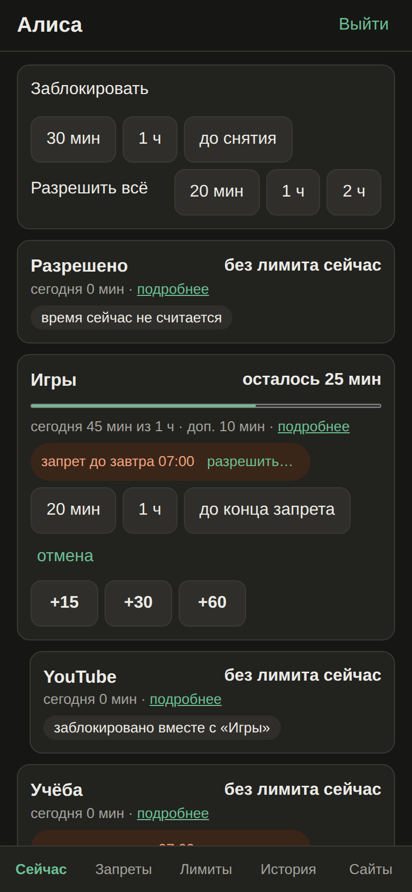
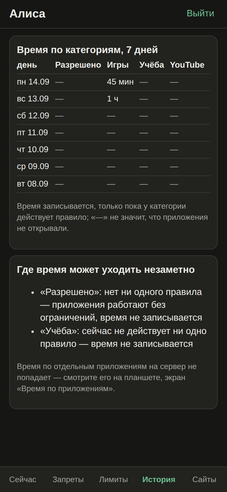
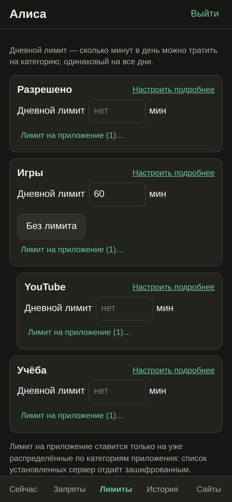
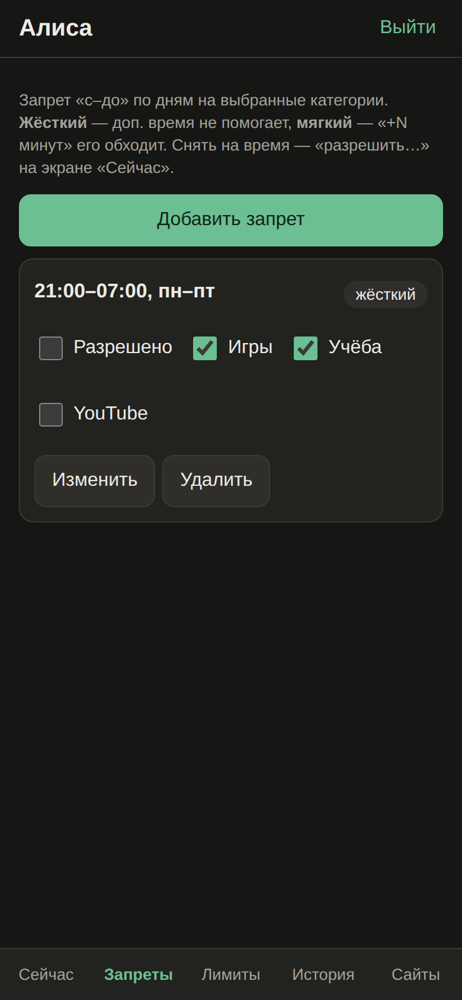
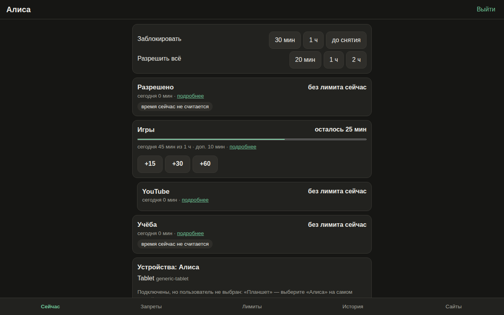
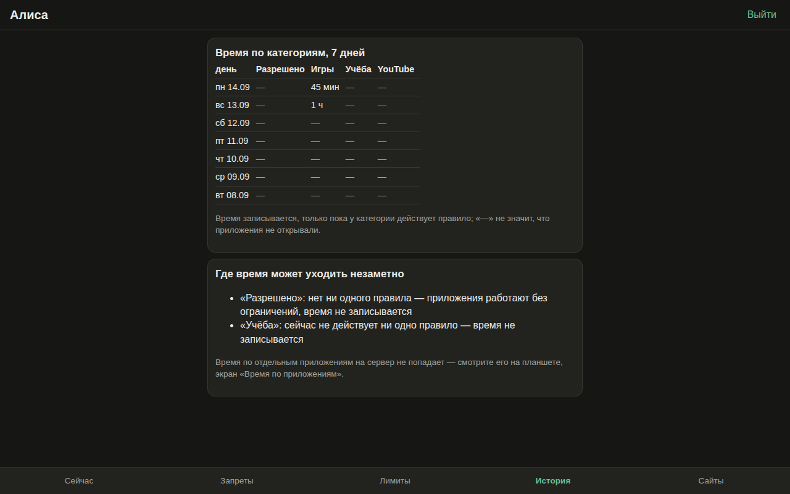

# Daily use

Everyday parent scenarios, ordered from most to least frequent. «Steps» are taps from the console
already open on «Сейчас» (Now); for comparison, the parent TimeLimit Android app and Google Family
Link. Step counts are counted from the screens' code; frequencies are estimates.

| # | Scenario | Console | TimeLimit app | Family Link |
| --- | --- | --- | --- | --- |
| P1 | How long has he used it today, how much is left | **0** | 1 | 2 |
| P2 | Give him 30 more minutes of games | **1** | ~7 | 3–4 |
| P3 | It's night/school time, but allow 20 minutes | **2** | ~6 | ~3 |
| P4 | Block now, dinner time | **1** | ~4 | 2 |
| P5 | Where did the time go — a loophole? | **1** | — | 2 |
| P6 | He installed a new app, allow/block it | not available (see [[FAQ]]) | ~5 | 2 |
| P7 | Allow this website | **3** | — | ~4 |
| P8 | One hour a day for this app | **5** (category limit — 3) | ~12 | ~5 |
| P9 | Bedtime 21:00–07:00 | **3** (own times and days — 5–6) | ~4 per category | ~5 |

Every action shows a toast «Отменить» (undo) for 8 seconds; reversible actions are never confirmed.
The console refreshes every 30 s.

## P1. Time used and left — «Сейчас»

The home screen is the child: per category the time used today, the limit, extra time and what is
left. On top: «Заблокировать» (block) and «Разрешить всё» (allow everything) for a while.
Chips explain the state of a category: «запрет до …» (ban until), «время вышло» (time is up),
«время сейчас не считается» (time is not counted now).

## P2. Extra time — «+15 / +30 / +60»

One tap on the category card. The toast confirms and offers «Отменить». Extra time counts for
today only and **does not lift a hard ban** — for that see P3.

## P3. Allow during a ban — «разрешить…»

When a ban is active, the category shows «запрет до 07:00» with «разрешить…» (allow…). Tap it and
pick «20 мин», «1 ч» or «до конца запрета» (until the ban ends). Subcategories blocked together
with the parent category say so.

## P4. Block now

«Заблокировать: 30 мин / 1 ч / до снятия» (until unblocked) at the top of «Сейчас» blocks all root
categories, including «Разрешено». «Разблокировать» removes it.

## P5. History and loopholes — «История»

Time per category for 7 days and «Где время может уходить незаметно» (where time can slip away):
categories without a rule active right now (their time is **not recorded at all**, so the history
shows «—»), limits switched off and forgotten, the category for unassigned apps. Per-app time is not
on the server — see it on the child's tablet.

## P7. Websites — «Сайты»

Add a line to «Разрешённые» (allowed) or «Запрещённые» (blocked), «Сохранить списки». Details — [[Website filter|Website-filter]].

## P8 and P9. Limits and bans

 

- «Лимиты» (limits): a daily limit per category; «Лимит на приложение…» moves an app into its own
  subcategory with a limit.
- «Запреты» (bans): «Добавить запрет» (add ban) → «Сохранить». Defaults: 21:00–07:00, every day, root
  categories. A ban card shows «жёсткий»/«мягкий» (hard/soft), «действует» (active now) and category
  checkboxes that apply immediately.

How this maps to TimeLimit rules — [[Bans and limits|Bans-and-limits]].

## Desktop

The same page works in a desktop browser.

## По-русски

Главный экран «Сейчас» отвечает на «сколько сидел и сколько осталось» без касаний; «+30» — одно
касание; «разрешить…» на плашке запрета — два; «Заблокировать» — одно; «История» с лазейками — одно;
сайт — три; лимит на приложение — пять; отбой 21:00–07:00 — три. Каждое действие отменяется из
уведомления «Отменить». Новые приложения без категории пульт не видит — сервер отдаёт список
установленных только зашифрованным.
