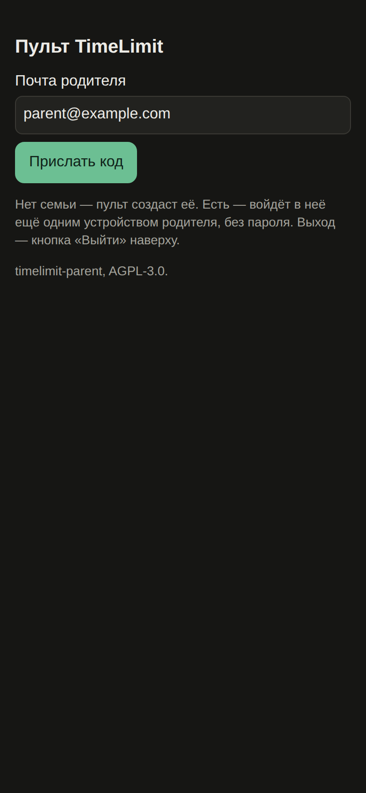
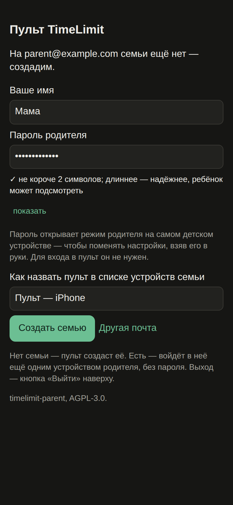
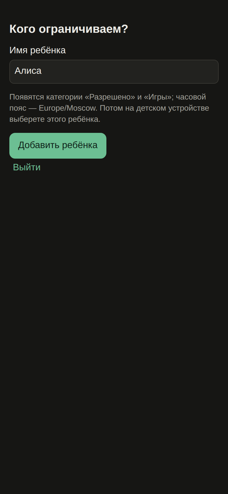
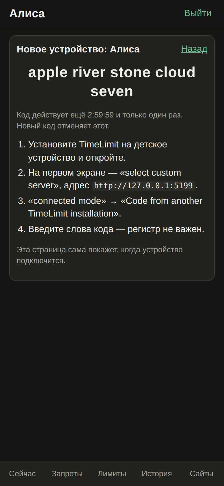

# Installation

Three pieces: a **sync server**, the **parent console** served next to it, and the **TimeLimit app
on the child's device**. Order: server → console (create the family and the child) → child device.

## 1. Server

You need a TimeLimit sync server. Two options:

| | Upstream cloud `api.timelimit.io` | Your own server |
| --- | --- | --- |
| Cost | 14-day trial, then a premium subscription for extra time, «allow for» and temporary lock | a VPS, a domain with TLS, SMTP for login codes, your time |
| Web console | **not possible**: the console must be served from the same origin as the server (see below) | yes |
| Sign-up | open | set `ALWAYS_PRO=yes`; restrict or close sign-up (`DISABLE_SIGNUP=yes`) once your family exists |

In practice the console needs **your own server**. Server requirements:

- [timelimit-server](https://codeberg.org/timelimit/timelimit-server) behind a reverse proxy that
  passes websockets (otherwise devices silently stop syncing);
- SMTP (`MAIL_TRANSPORT`) — login codes are sent by mail;
- the server must allow `sign-in-into-family` for your family.

**Patched server branch.** The website filter (`UPDATE_USER_URL_FILTER`, server `apiLevel` 10) and
Google sign-in (`POST /auth/sign-in-by-google`, needs `GOOGLE_CLIENT_ID`) are changes on a
`parent-console` branch of timelimit-server that is **not published yet**. Everything else works with
the upstream server; the «Сайты» screen then says the server is too old and the CLI refuses
`filter set`. The changes are additive: old Android clients keep working.

## 2. Parent console

Requirements: Node.js 22.18+.

```bash
git clone https://github.com/mpashka/timelimit-parent && cd timelimit-parent
npm install
npm test               # hermetic, no network
npm run build          # dist/ (CLI) and dist/web/ (web console)
```

Serve `dist/web/` **from the same origin as the sync server** — the server sends CORS headers only
for `/admin`. Use a path like `/console/`, not `/parent/` (that is a server API path). Asset paths are
relative. Example for nginx:

```nginx
location /console/ { alias /srv/timelimit-parent/dist/web/; }
```

Do not cache `index.html` and `config.json` for long. `GOOGLE_CLIENT_ID=... npm run build` adds the
«Войти через Google» button (needs a Google OAuth client and the patched server).

Try it without a server: `npm run web:mock` serves the console on
`http://127.0.0.1:5173/console/` with a fake API (code `new` — a mail without a family, `000` — wrong
code). All screenshots in this wiki come from the mock with fake data.

### First sign-in: create the family (≈ 16 steps)

| | |
| --- | --- |
|  | **1.** Open the console, enter the parent mail, «Прислать код» (send code). **2.** Enter the three words from the mail, «Дальше». |
|  | **3.** No family on this mail yet → your name and the **parent password**, «Создать семью». The password is hashed in the browser; it only unlocks parent mode on the child's device and is not needed for the console. |
|  | **4.** «Кого ограничиваем?» (who is restricted): child name, «Добавить ребёнка». Categories «Разрешено» (allowed) and «Игры» (games) are created. |
|  | **5.** «Подключить устройство» (connect device) shows a five-word code, valid 3 hours and once. The page notices by itself when the device joins. |

If the mail already has a family, the console just signs in as another parent device.

## 3. Child device

1. Install TimeLimit on the child's device and open it.
2. On the very first screen tap «select custom server» and enter your server address — the server
   can not be changed later without reinstalling.
3. Choose «connected mode» → «Code from another TimeLimit installation», enter the five words.
4. On the device choose the child as its user, grant the permissions (usage access, device admin,
   accessibility, notifications).

Put launcher, phone and settings into «Разрешено» before assigning the child: apps without a category
are blocked.

**For the website filter** the child device additionally needs:

- a **non-store build** of TimeLimit (the Play Store build hides device-owner features behind
  `BuildConfig.storeCompilant`) — and for the filter itself the patched Android build from the
  `parent-console` branch (not published yet);
- the **device owner** role, granted over ADB on a device without accounts:

```bash
adb shell dpm set-device-owner \
  io.timelimit.android.aosp.direct/io.timelimit.android.integration.platform.android.AdminReceiver
```

## По-русски

Нужны свой сервер синхронизации (облако апстрима не подходит: пульт отдаётся с того же адреса, что
и сервер), собранный пульт под `/console/` и TimeLimit на детском устройстве. Фильтр сайтов и вход
через Google требуют доработанного сервера (ветка `parent-console`, пока не опубликована), фильтр ещё
и нашей сборки Android и роли device owner. Порядок: почта → код из письма → имя и пароль родителя →
имя ребёнка → код из пяти слов → на детском устройстве «select custom server», «connected mode», код.
Всего у родителя ≈ 16 шагов.
