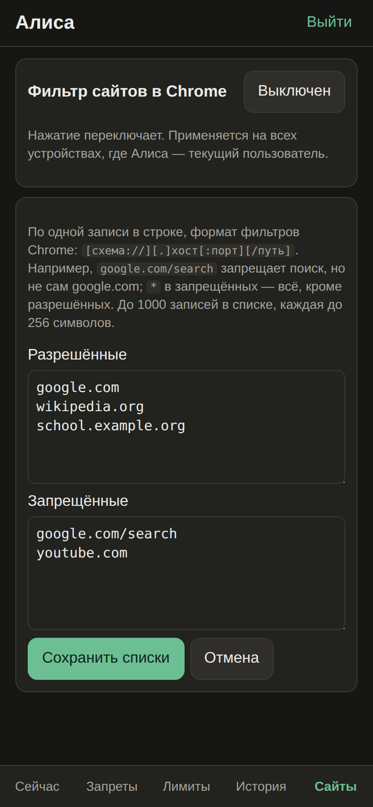

# Website filter

The child's Chrome gets an **allow list** and a **block list** through Android managed
configuration (`URLAllowlist` / `URLBlocklist`). The filter belongs to the child, not a device: it
applies on every device where this child is the current user.



## Format

One entry per line, Chrome URL filter format: `[scheme://][.]host[:port][/path][@query]`.
Up to 1000 entries per list, each up to 256 characters, no duplicates.

- `example.org` — the host and its subdomains; `.example.org` — exactly this host;
- a path narrows the entry: `google.com/search` is search only, not the whole google.com;
- `*` in the block list — everything except the allow list.

### Example: Google without search

| Allowed | Blocked |
| --- | --- |
| `google.com`<br>`wikipedia.org`<br>`school.example.org` | `google.com/search`<br>`youtube.com` |

Maps, Docs and Translate keep working, search and YouTube do not. A strict whitelist is
`*` in «Запрещённые» plus the allowed sites.

In the console: «Сайты» → edit the lists → «Сохранить списки»; the button «Включён/Выключен»
(on/off) toggles the filter. CLI:

```bash
tlp filter set --allow google.com,wikipedia.org --block google.com/search,youtube.com --dry-run
tlp filter show
tlp filter off
```

## Requirements

The filter is new parent action `UPDATE_USER_URL_FILTER`, not in upstream TimeLimit yet:

1. **Patched server** (`parent-console` branch of timelimit-server, `apiLevel` 10). With an older
   server the console shows an explanation and the CLI refuses — an old server would silently drop
   the setting.
2. **Patched Android build** of TimeLimit (`parent-console` branch of timelimit-android,
   non-store variant). Both branches are not published yet.
3. TimeLimit is the **device owner** on the child device (see [[Installation]]) — only a device
   owner can set managed configuration of Chrome.

When enabled, the app also sets `IncognitoModeAvailability=1` (no incognito) and
`DnsOverHttpsMode=off` for `com.android.chrome` and `com.chrome.beta`. Other browsers are not
filtered — put them into a blocked category.

## По-русски

Белый и чёрный список сайтов Chrome через managed configuration, на ребёнка, а не на устройство.
Формат — фильтры Chrome; `google.com/search` запрещает поиск, но не весь google.com; `*` в запрещённых —
всё, кроме разрешённых. Нужны доработанный сервер (`apiLevel` 10), наша сборка Android и роль device
owner у TimeLimit; обе ветки пока не опубликованы. Другие браузеры фильтр не видит — их блокируют
категорией.
